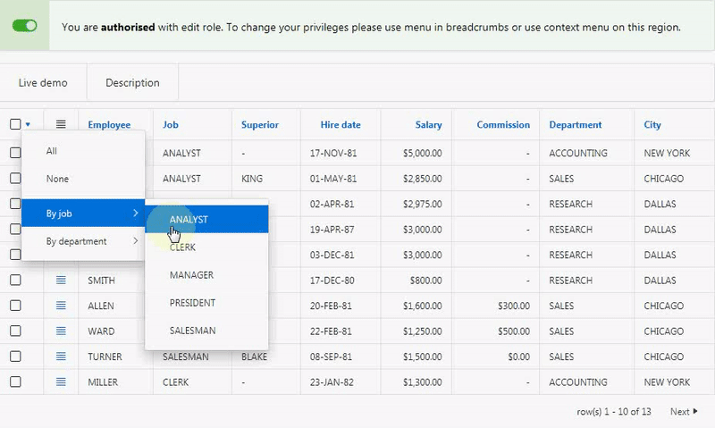

# Pretius APEX Context Menu

Pretius APEX Context Menu is dynamic action plugin implementing APEX popup menu based on defined list. 
The plugin can be attached to any HTML element and respects authorisation scheme rules.
The plugin allows to extend existing entries and to add dynamically new entries.

## Preview



## Table of Contents 

TBD

## License

MIT

## Demo application

[https://apex.oracle.com/pls/apex/f?p=113048:1](https://apex.oracle.com/pls/apex/f?p=113048:1)

## Features at Glance

* compatible with Oracle APEX 5.1, 18.x, 19.x
* basic usage doesn't require JavaScript knowledge
* [uses native APEX menu widget](https://docs.oracle.com/database/apex-18.1/AEXJS/menu.html)
* based on APEX list
  * supports authorization schemes
  * list entries behaviour can be altered on runtime
  * supports multiple levels of menu
* can be bind with any DOM element

## Roadmap
* not yet available

## Install

### Installation package
* `PRETIUS_APEX_CONTEXT_MENU.sql` - the plugin package specification
* `PRETIUS_APEX_CONTEXT_MENU.plb` - the plugin package body
* `dynamic_action_plugin_com_pretius_apex_contextmenu.sql` - the plugin installation file for Oracle APEX 5.1 or higher

### Install procedure
To successfully install the plugin follow those steps:
1. Install package `PRETIUS_APEX_CONTEXT_MENU` in Oracle APEX Schema
1. Install the plugin file `dynamic_action_plugin_com_pretius_apex_contextmenu.sql`

## Usage Guide

### Basic usage

1. Create APEX List `POPUP_MENU`
1. Create entries and define according to your needs (authorisation scheme, action etc)
1. Create new button `BTN_POPUP_MENU`
1. Create dynamic action
    1. Set `Event` to `Click`
    1. Set `Selection Type` to `Button`
    1. Set `Button` to `BTN_POPUP_MENU`
1. Create `True` action
    1. Set `Action` to `Pretius APEX Context Menu [Plug-In]`
    1. Set `List name` to `POPUP_MENU`
1. Save & run page

Clicking the button `BTN_POPUP_MENU` will create popup menu.

### Advanced usage

Please read inline help text for attribute `Override Behaviour` for detailed information about JSON object extending existing list entry. 
List entry object mapps properties from official API (https://docs.oracle.com/database/apex-18.1/AEXJS/menu.html#.Item) as follows:

Property              | Is supported
----------------------|-------------
**type**              | **Yes**
**id**                | **Yes**
**label**             | **Yes**
**labelKey**          | **Yes**
offLabel              | No
offLabelKey           | No
onLabel               | No
onLabelKey            | No
**hide**              | **Yes**
**disabled**          | **Yes**
iconType              | No
**icon**              | **Yes**
**iconStyle**         | **Yes**
**href**              | **Yes**
**action**            | **Yes**
set                   | No
get                   | No
**accelerator**       | **Yes**
menu                  | No
choices               | No
choices[].label       | No
choices[].labelKey    | No
choices[].value       | No
choices[].disabled    | No
choices[].accelerator | No
current               | No


1. Create APEX List `POPUP_MENU_EXTEND`
1. Create entry 
    1. Set `List Entry Label` to `Extended behaviour`
    1. Set `Target type` to `URL`
    1. Set `URL Target` to `javascript: void(0);`
    1. Set `User defined Attribute 1` to `EXTENDED_BEHAVIOUR`
1. Create new button `BTN_POPUP_MENU_EXTEND`
1. Create dynamic action
    1. Set `Event` to `Click`
    1. Set `Selection Type` to `Button`
    1. Set `Button` to `BTN_POPUP_MENU_EXTEND`
1. Create `True` action
    1. Set `Action` to `Pretius APEX Context Menu [Plug-In]`
    1. Set `List name` to `POPUP_MENU_EXTEND`
    1. In `Settings` check `Override Behaviour`
    1. Set `Override behaviour` to `*`
1. Save & run page

#### Alter entry behaviour

`*` JavaScript code for point 5.iv
```javascript
return {
  "BTN_POPUP_MENU_EXTEND": {
    "action": function( pMenuOptions, pTriggeringElement ){
      //Code to be executed when users clicks on entry
      alert('Altered action');
      return void(0);
    },
    "disabled": function( pMenuOptions, pEntry ) {
      return false;
    },
    "hide": function(pMenuOptions){
      return false;
    }
  }
};
```

#### Add submenu

`*` JavaScript code for point 5.iv
```javascript
return {
  "BTN_POPUP_MENU_EXTEND": {
    "items": [
      {
        "type": "action",
        "labelKey": "Action 1",
        "action": function( pMenuOptions, pTriggeringElement ){
          alert("Action 1");
        }
      },
      {
        "type": "action",
        "labelKey": "Action 2",
        "action": function( pMenuOptions, pTriggeringElement ){
          alert("Action 2");
        }
      },
      {
        "type": "action",
        "labelKey": "Action 2",
        "action": function( pMenuOptions, pTriggeringElement ){
          alert("Action 3");
        }
      }
    ]
  }
};
```


## Plugin Settings

Detailed information about how to use every attribute of the plugin is presented in built-in help texts in APEX Application Builder.

### Plugin Events

### Translations

## Changelog

### 1.0.0 
Initial Release

## Known issues

TBD

## About Author
Author | Github | Twitter | E-mail
-------|--------|---------|-------
Bartosz Ostrowski | [@bostrowski](https://github.com/bostrowski) | [@bostrowsk1](https://twitter.com/bostrowsk1) | bostrowski@pretius.com

## About Pretius
Pretius Sp. z o.o. Sp. K.

Address | Website | E-mail
--------|---------|-------
Przy Parku 2/2 Warsaw 02-384, Poland | [http://www.pretius.com](http://www.pretius.com) | [office@pretius.com](mailto:office@pretius.com)


