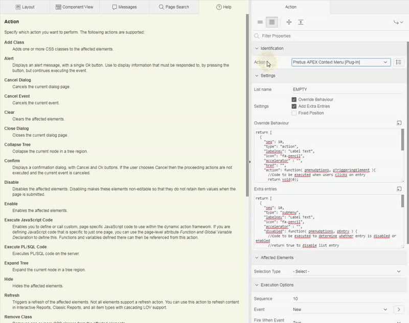

# Pretius APEX Context Menu

Pretius APEX Context Menu is dynamic action plugin implementing APEX popup menu based on defined APEX list. The plugin can be attached to any HTML element and renders entries according to authorisation scheme result. Menu entries can be extended by overriding behaviour, dynamically adding submenu and by adding new entries.

## Preview


## Table of Contents 

- [License](#license)
- [Demo application](#demo-application)
- [Features at Glance](#features-at-glance)
- [Roadmap](#roadmap)
- [Install](#install)
    - [Installation package](#installation-package)
    - [Install procedure](#install-procedure)
- [APEX list integration](#apex-list-integration)
    - [Conditions](#conditions)
    - [Authorization schemes](#authorization-schemes)
    - [User defined attributes for list entry](#user-defined-attributes-for-list-entry)
- [Usage Guide](#usage-guide)
    - [Basic usage](#basic-usage)
    - [Advanced usage](#advanced-usage)
- [Plugin Settings](#plugin-settings)
    - [Plugin Events](#plugin-events)
    - [Translations](#translations)
- [Changelog](#changelog)
    - [1.0.0](#100)
- [Known issues](#known-issues)
- [About Author](#about-author)
- [About Pretius](#about-pretius)
- [Support](#support)
    - [Free support](#free-support)
    - [Paid support](#paid-support)


## License

MIT

## Demo application

[https://apex.oracle.com/pls/apex/f?p=113048:1](https://apex.oracle.com/pls/apex/f?p=113048:1)

## Features at Glance

* compatible with Oracle APEX 5.1, 18.x, 19.x
* basic usage doesn't require JavaScript knowledge
* [uses native APEX menu widget](https://docs.oracle.com/database/apex-18.1/AEXJS/menu.html)
* based on APEX list
  * supports authorization schemes
  * supports basic conditions
* list entries can be extended on runtime
    * to override action on click
    * to disable entry
    * to hide entry
    * to add submenu defined outside APEX list
* can be bind with any DOM element

## Roadmap
* not yet available

## Install

### Installation package
* `PRETIUS_APEX_CONTEXT_MENU.sql` - the plugin package specification
* `PRETIUS_APEX_CONTEXT_MENU.plb` - the plugin package body
* `dynamic_action_plugin_com_pretius_apex_contextmenu.sql` - the plugin installation file for Oracle APEX 5.1 or higher

### Install procedure
To successfully install the plugin follow those steps:
1. Install package `PRETIUS_APEX_CONTEXT_MENU` in Oracle APEX Schema
1. Install the plugin file `dynamic_action_plugin_com_pretius_apex_contextmenu.sql`

## APEX list integration

### Conditions

The plugin checks entry defined conditions. For conditions types

* PLSQL_EXPRESION
* PLSQL_EXPRESSION
* FUNC_BODY_RETURNING_BOOLEAN
* EXISTS
* NOT_EXISTS
* NEVER

result is evaluated and if condition is not met then entry is not rendered. If entry condition is other type than listed above then entry is not rendered.

### Authorization schemes

The plugin checks entry defined authorization scheme. If current result is `true` then entry is rendered. 

### User defined attributes for list entry

The plugin uses **user defined attributes** to change behaviour of the list entry. See table below

Property     | Description
-------------|------------
Attribute 01 | id used to identify entry
Attribute 02 | when set to `true` then entry is disabled
Attribute 03 | when set to `true` then entry is not rendered
Attribute 04 | reserved by APEX navigation template to set title. Not working (?)
Attribute 05 | reserved by APEX navigation template to set shortcut (?). Not working (?)
Attribute 06 | provided text is used as accelerator text displayed right to entry label.
Attribute 07 | when set to `separator` then display as horizontal separator
Attribute 08 | not used
Attribute 09 | not used
Attribute 10 | not used


## Usage Guide

### Basic usage

1. Create APEX List `POPUP_MENU`
1. Create entries and define according to your needs (authorisation scheme, action etc)
1. Create new button `BTN_POPUP_MENU`
1. Create dynamic action
    1. Set `Event` to `Click`
    1. Set `Selection Type` to `Button`
    1. Set `Button` to `BTN_POPUP_MENU`
1. Create `True` action
    1. Set `Action` to `Pretius APEX Context Menu [Plug-In]`
    1. Set `List name` to `POPUP_MENU`
1. Save & run page

Clicking the button `BTN_POPUP_MENU` will create popup menu.

### Contextual menu

The plugin can be implemented to alter default context menu (right mouse button click).

1. Create APEX List `POPUP_MENU`
1. Create entries and define according to your needs (authorisation scheme, action etc)
1. Create dynamic action
    1. Set `Event` to `Custom`
    1. Set `Custom Event` to `contextmenu`
    1. Set `Selection Type` to `JavaScript Expression`
    1. Set `JavaScript Expression` to `document`
1. Create `True` action
    1. Set `Action` to `Pretius APEX Context Menu [Plug-In]`
    1. Set `List name` to `POPUP_MENU`
    1. _[Optional]_ Set `Affected Elements` to narrow area in which context menu will be available. For example region.
1. Save & run page

Contextual menu can be applied to any element by specyfing `Selection Type` = `jQuery Selector`. Contextual menu can be positioned differently:

* when `Selection Type` = `JavaScript Expression` and `JavaScript Expression` = `document` then menu is positioned to right click event position properties `event.pageX` and `event.pageY`
    * when `Affected Elements` is defined then menu is available only for area defined by given `Affected Elements`
* When `Selection Type` = `jQuery Selector` then menu is positioned to given `jQuery Selector`

### Advanced usage

Please read inline help text for attribute `Override Behaviour` for detailed information about JSON object extending existing list entry. 

1. Create APEX List `POPUP_MENU_EXTEND`
1. Create entry 
    1. Set `List Entry Label` to `Extended behaviour`
    1. Set `Target type` to `URL`
    1. Set `URL Target` to `javascript: void(0);`
    1. Set `User defined Attribute 1` to `EXTENDED_BEHAVIOUR`
1. Create new button `BTN_POPUP_MENU_EXTEND`
1. Create dynamic action
    1. Set `Event` to `Click`
    1. Set `Selection Type` to `Button`
    1. Set `Button` to `BTN_POPUP_MENU_EXTEND`
1. Create `True` action
    1. Set `Action` to `Pretius APEX Context Menu [Plug-In]`
    1. Set `List name` to `POPUP_MENU_EXTEND`
    1. In `Settings` check `Override Behaviour`
    1. Set `Override behaviour` to `*`
1. Save & run page

#### Alter entry behaviour

`*` JavaScript code for point 5.iv
```javascript
return {
  "BTN_POPUP_MENU_EXTEND": {
    "action": function( pMenuOptions, pTriggeringElement ){
      //Code to be executed when users clicks on entry
      alert('Altered action');
      return void(0);
    },
    "disabled": function( pMenuOptions, pEntry ) {
      return false;
    },
    "hide": function(pMenuOptions){
      return false;
    }
  }
};
```

#### Add submenu

`*` JavaScript code for point 5.iv
```javascript
return {
  "BTN_POPUP_MENU_EXTEND": {
    "items": [
      {
        "type": "action",
        "labelKey": "Action 1",
        "action": function( pMenuOptions, pTriggeringElement ){
          alert("Action 1");
        }
      },
      {
        "type": "action",
        "labelKey": "Action 2",
        "action": function( pMenuOptions, pTriggeringElement ){
          alert("Action 2");
        }
      },
      {
        "type": "action",
        "labelKey": "Action 3",
        "action": function( pMenuOptions, pTriggeringElement ){
          alert("Action 3");
        }
      }
    ]
  }
};
```

List entry properties for APEX menu widget are described in [official API](https://docs.oracle.com/database/apex-18.1/AEXJS/menu.html#.Item). The plugin supports properties as follows:

Property              | Is supported
----------------------|-------------
**type**              | **Yes**
**id**                | **Yes**
**label**             | **Yes**
**labelKey**          | **Yes**
offLabel              | No
offLabelKey           | No
onLabel               | No
onLabelKey            | No
**hide**              | **Yes**
**disabled**          | **Yes**
iconType              | No
**icon**              | **Yes**
**iconStyle**         | **Yes**
**href**              | **Yes**
**action**            | **Yes**
set                   | No
get                   | No
**accelerator**       | **Yes**
menu*                 | No
choices               | No
choices[].label       | No
choices[].labelKey    | No
choices[].value       | No
choices[].disabled    | No
choices[].accelerator | No
current               | No

`*` menu property is implemented via property `items` to avoid unnecessary nested objects. See `Inline Help Text` for attribute `Override behaviour` for example implmentation.

## Plugin Settings

Detailed information about how to use every attribute of the plugin is presented in built-in help texts in APEX Application Builder.



### Plugin Events

The plugin doesn't expose any extra events. To handle APEX menu events please refer [official API](https://docs.oracle.com/database/apex-18.1/AEXJS/menu.html#events-section).

### Translations

The plugin does't use elements that can't be translated via APEX native translation capabilities.

## Changelog

### 1.0.0 
Initial Release

## Known issues

* not yet available

## About Author
Author | Github | Twitter | E-mail
-------|--------|---------|-------
Bartosz Ostrowski | [@bostrowski](https://github.com/bostrowski) | [@bostrowsk1](https://twitter.com/bostrowsk1) | bostrowski@pretius.com

## About Pretius
Pretius Sp. z o.o. Sp. K.

Address | Website | E-mail
--------|---------|-------
Przy Parku 2/2 Warsaw 02-384, Poland | [http://www.pretius.com](http://www.pretius.com) | [office@pretius.com](mailto:office@pretius.com)

## Support
Our plugins are free to use but in some cases you might need to contact us. We are willing to assist you but in certain circumstances you will be charged for our time spent on helping you. Please keep in mind we do our best to keep documentation up to date and we won't answer question for which there is explaination in documentation (at github and as help text in application builder).

All request (bug fix / change request) should be posted in Issues Tab at github repository.

### Free support
We do support the plugin in certain cases such as bug fixing and change request. If you have faced issue that might be bug please check Issues tab in github repository. In case you won't be able to find related issue please raise the issue following these rules:

* issue should contain login credentials to application at apex.oracle.com where issue is reproduced
* issue should contain steps to reproduce the issue in demo application
* issue should contain description about it's nature

### Paid support
In case you are not able to implement the plugin or you are willing to have custom implementation based on the plugin attributes (ie. custom JavaScript callbacks) we are willing to help you. Please send inquiry to <email> with description what you want us to help you with. We will contact you as soon as possible with pricing and possible dates.
